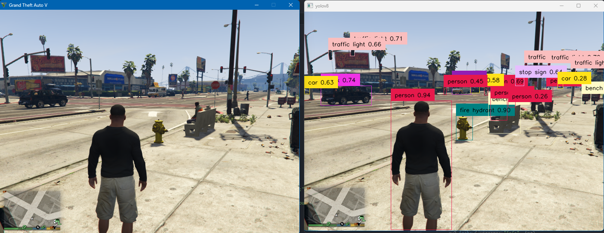
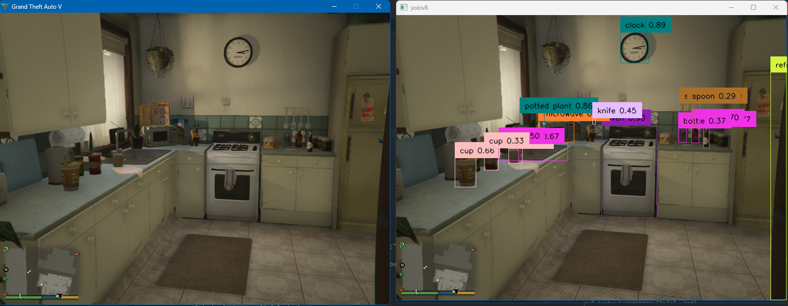
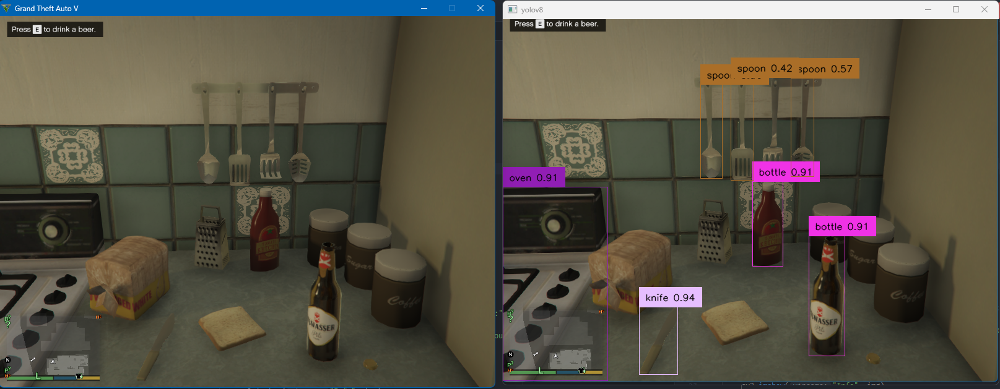
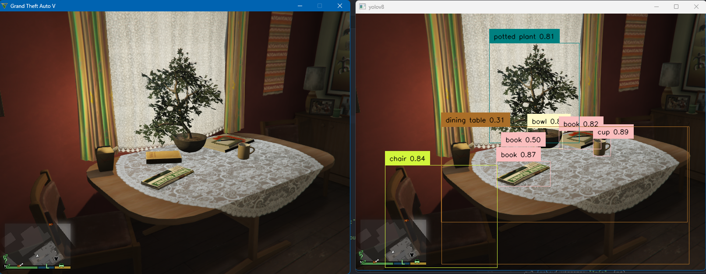
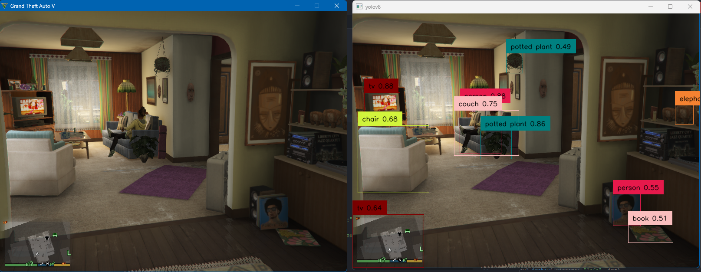
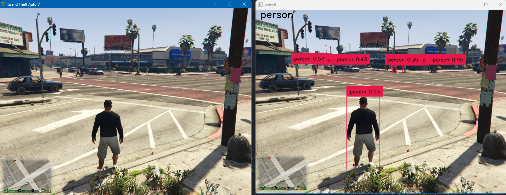
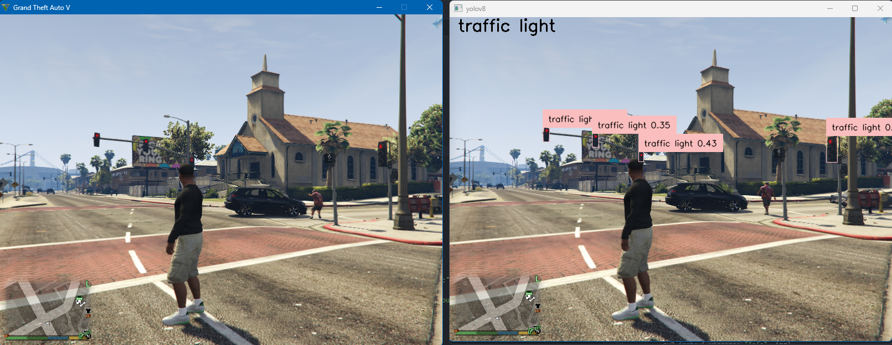

# Object Detection in GTA V
Object Detection in GTA V using **OpenCV** and **YOLOv8** in Python.

# Output Pics
Side-by-side comparison of actual game and the YOLO detected objects.
### 1. All Detections - Street

### 2. All Detections - Household

### 3. All Detections - Kitchen

### 4. All Detections - Dining Table

### 5. All Detections - House Hallway

### 6. Person Detections - Street

### 7. Traffic Light Detections - Street

